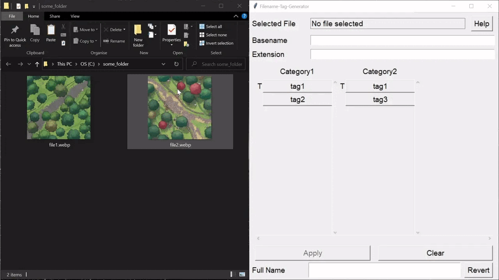
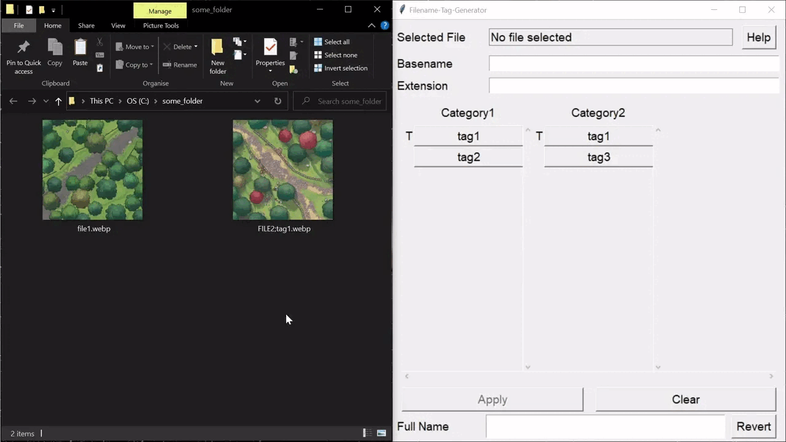
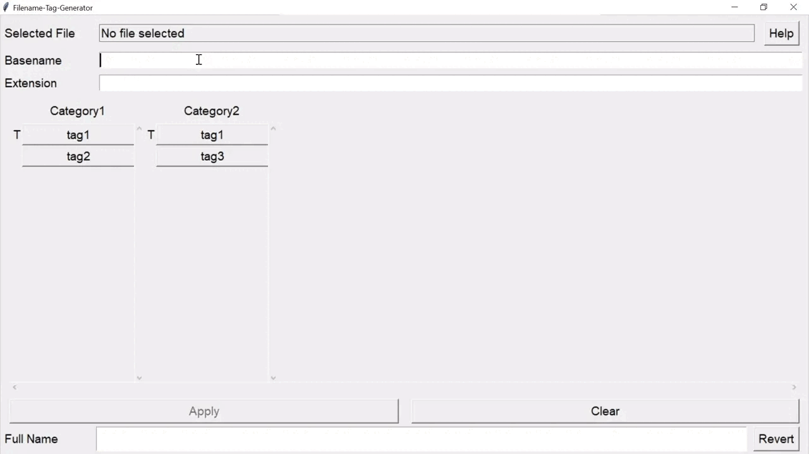
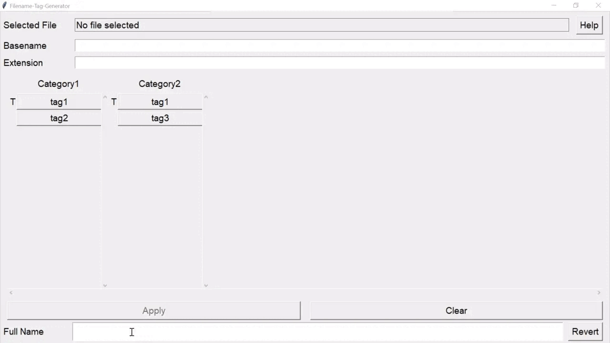

# Table of Contents

1. [About](#about)
1. [Where to Start](#where-to-start)
1. [Limitations](#limitations)
1. [Usage](#usage)
1. [Command Line Options](#command-line-options)
1. [Searching](#searching)
1. [Install](#install)
1. [Configuration](#configuration)
1. [Why Filenames?](#why-filenames)
1. [Alternatives](#alternatives)

# About

The primary purpose of this program is to tags files by appending the tags to the name of the file.

The use case it is designed for is the organization of RPG maps and other media files a DM/GM comes in contact with.

## Example

To add the tags 

`tag1`, `tag2` and `tag3`

to the file `some_map.png` it would be renamed to

`SOME-MAP;tag1_tag2_tag3.png`

# Where to Start

If you just want to see how to the program works go to [Usage](#usage)

If you are a new user who is planning to use this program you should read about its [limitations](#limitations) first.

If you want to understand the decisions that lead to this mess go to [Why Filenames?](#why-filenames)

If you think that putting the tags into the filenames is a bad solution go to [Alternatives](#alternatives)

# Limitations

Putting the tags into the filenames is limited by the maximum path length and maximum filename length.
Windows, Linux, GoogleDrive, OneDrive, Dropbox, etc. all have different restraints
on those.

- Linux has a maximum filename length of 255 characters for most filesystems (including EXT4), and a maximum path of
  4096
  characters. [link](https://unix.stackexchange.com/questions/32795/what-is-the-maximum-allowed-filename-and-folder-size-with-ecryptfs)
- Without Long Paths enabled Windows 10 has a maximum path length of
  260 characters. [link](https://docs.microsoft.com/en-us/windows/win32/fileio/maximum-file-path-limitation?tabs=registry)
- With Long Paths enabled Windows 10 has a maximum path length of
  32,767 characters. [link](https://docs.microsoft.com/en-us/windows/win32/fileio/maximum-file-path-limitation?tabs=registry#:~:text=path%20length%20of-,32%2C767%20characters,-.%20This%20type%20of)

If you intend to use this tool you should check what the systems you are planning to use
are supporting. Maybe even run some tests. If you plan to use this program on Windows you will have to enable Long Paths, almost certainly.

Make yourself clear about these limitations before using this tool as they cannot be circumvented.

That said in most cases it´s pretty easy to stay below the limits unless you use very high number of long tags.

# Usage

The program can be used for two purposes:

1. Directly rename files via drag and drop
2. Generate names

## Renaming Files

### Single

To rename a file drag and drop it from your file browser into the application window.
The program will then revert the filename back into basename, tags and extensions.
For this process to go smoothly make sure the filename doesn't contain special characters in its basename or tags.
See [Configuration](#configuration) for more information.
Any tags in the filename that are not in your tags file will get lost in this translation.
Once you dropped the file into the application you can change the basename and extension and select the tags you want to add.

As soon as you click the `Apply` button the file will be renamed in accordance to what you selected.

### Multiple

You can drag and drop multiple files into the application window.
In this case the program behaves very similar to single file drop with a few changes.

- The tag buttons will be changed to checkboxes with one of three states `On` and `Off` and `Mixed`.
- The `Selected File` field will be disabled. You will have to remember which files you dragged into the application.
- `Basename` and `Extension` input fields will be disabled. You will have to adjust the basename and extension beforehand.

Checkbox states:

- The `On` state indicates, that all files have this tag.
- The `Off` state indicates, that no file has this tags.
- The `Mixed` state indicates, that some, but not all, file have this tag.

When you click on a checkbox with state `Mixed` it will change to `On`. After that you can only switch between `On` and `Off`.
  => Don't touch a `Mixed` checkbox unless want to add or remove this tag to/from all files

As soon as you click the `Apply` button the files will be renamed in accordance to what you selected.
If you disabled a checkbox that was previously `Mixed` or `On` the tag will be removed from all files.
If you enabled a checkbox that was previously `Mixed` or `Off` the tag will be added to all files.

## Generating Map Names

This one is useful for organizing maps via names in your VTT.

Simply enter a basename and click on the tags you want to select and copy the result from the `Full Name` field.

If you want to add or remove tags to a name paste it in `Full Name` and click the `Revert` button.

# Command Line Options

For those who want a bit more control over the program I added some command line options.

    Filename-Tag-Generator [--tags path-to-tags-file] [--config path-to-config-file] [--verbosity {info|debug}] [--setup] [--version]
    
      --tags               specify a tags file
      --config             specify a config file
      --verbosity          set the verbosity of the console logger
      --setup              run interactive setup
      --version            print version and exit

## Example

You may want to have different tags files. For example one for maps and one for characters which are named `map-tags.json` and `character-tags.json` respectively.

The program wouldn't find those because they don't have the default name, but you can start the program by pointing them directly to the tags with

`Filename-Tag-Generator --tags maps-tags.json`

or

`Filename-Tag-Generator --tags character-tags.json`

# Searching

This program does not have any search functionality. Instead, you use whatever file browser your system has which usually has all the features you need. Windows, Ubuntu, GDrive, Dropbox, etc. all provide thumbnail views and indexed search.

## Examples

On Windows the [syntax](https://docs.microsoft.com/en-us/windows/win32/lwef/-search-2x-wds-aqsreference) is very easy. The query

`"tag1" ("tag2" OR "tag3") NOT kind:folder`

would give you all files with the tag `tag1` that also have `tag2` or `tag3`

The Google Drive search syntax is different, and I couldn't find any good references. With a bit of trial and error I found that:

`"tag1"("tag2"|"tag3")-type:folder`

would be equal to the above. It's important to not use whitespaces. `|` operates as (logical) or. `-` excludes stuff.

# Install

## Windows

You can install the program in two ways. You can either download one of the prebuilt exe files from [releases](https://github.com/watermelonwolverine/Filename-Tag-Generator/releases) or you can install it using Python.

### Using Prebuilt Binary

1. Download exe file from one of the [releases](https://github.com/watermelonwolverine/Filename-Tag-Generator/releases)
2. Put the binary in a folder of your choice. For example `C:\Users\<your-username>\Programs\watermelonwolverine\Filename-Tag-Generator`
3. Either run the  program for a first time setup or go directly to [configuration](#configuration) to read about configuration files.

### Using Python

This section assumes that you have Python version >= 3.10 installed on your system and that you have some basic programming and command line knowledge.
Also, you must have installed Tkinter when you were installing Python.
If you have multiple versions on your system make sure you are using the right one using `python.exe --version`

1. Run `python.exe -m pip install <link-to-whl-file-under-releases>`
2. Find out where Python puts your console scripts. Usually that is in the `Scripts` directory of your Python installation.
3. Either run the program for a first time setup or go directly to [configuration](#configuration) to read about configuration files.

## Ubuntu

You can install the program in two ways. You can either download one of the prebuilt exe files from [releases](https://github.com/watermelonwolverine/Filename-Tag-Generator/releases) or you can install it using Python.

### Using Prebuilt Binary

1. Download binary from one of the [releases](https://github.com/watermelonwolverine/Filename-Tag-Generator/releases)
2. Put the binary in a folder of your choice.
3. Either run the  program for a first time setup or go directly to [configuration](#configuration) to read about configuration files.

### Using Python

This section assumes that you have Python version >= 3.10 installed on your system and that you have some basic programming and command line knowledge.
You must also install tkinter for your python version. Under Ubuntu that can usually be done with `apt install pythonX-tk` with `X` being the Python version you use.

1. Run `pythonX -m pip install <link-to-whl-file-under-releases>`
2. Find out where Python puts your console scripts. Usually that is in the `usr/local/bin`.
3. Either run the  program for a first time setup or go directly to [configuration](#configuration) to read about configuration files.

# Configuration

Two files are used to configure the program

- Tags files, named `tags.json`
- Config files, named `config.json`

Both are JSON files and need to be edited manually (as I cannot be bothered to spend countless hours on an editor)

The program looks for configuration files in the following order:

1. In the execution directory. I.e. where the executable is located.
2. In the user config directory.
    1. On Windows that's usually `C:\users\<user>\AppData\Local\watermelonwolverine\Filename-Tag-Generator`
    2. On Linux that's usually `/home/<user>/TODO`
3. In the system config directory.
    1. On Windows that's usually `C:\ProgramData\watermelonwolverine\Filename-Tag-Generator`
    2. On Linux that's usually `/home/<user>/TODO`

You can also specify the path to each file when starting from the command line using the `--config` and `--tags`
options. This way you can have multiple tags and config files for different purposes. See [Command Line Options](#command-line-options)

The program can run without a config file, but it needs a tags file.

## Tags

The tags usually live in a `tags.json` file that follows the following structure:

    {
      "ftg-version": "0.1.0",

      "categories": {
        "category-name1": {
          "tag1": "tag1-display-name",
          "tag2": "tag2-display-name"
        },
        "category-name2": {
          "tag1": "tag1-display-name",
          "tag3": "tag3-display-name"
        }
      }
    }

You can have as many categories under `categories` as you want. You can also have as many tags under each category as you want.

One tag can be in multiple categories as long as it has the same display-name everywhere.

For example: `"dungeon" : "Dungeon"` may fit into both categories `Nature` and `Civilization`.

## UI and Behaviour

You can configure the UI and the naming behaviour using a config file which is usually named `config.json`.

The config file with the default values would look like this:

    {
      "ftg-version": "0.1.0",
      "ui-config": {
        "font-size": 14,
        "padding-small": 5,
        "padding-big": 10,
        "button-width": 15
      },
      "naming-config": {
        "adjust-basename": true,
        "capitalize-basename": true,
        "replace-basename-spacer": true,
        "basename-spacer": "-",
        "basename-tags-separator": ";",
        "tag-separator": "_"
      }
    }

I will not explain every single detail as most should be self-explanatory.

The most important ones are:

- `basename-tags-separator` : the string that will be used to separate the basename from the tags. Make sure this is unique and doesn't appear in any tag or in the basename.
- `tag-separator` : the string that will be used to separate the tags. Make sure this is unique and doesn't appear in any tag or in the basename.
- `adjust-basename` : if this is set to `true` the program will adjust the basename
- `capitalize-basename` : if this is set to `true` the basename will be capitalized when adjusted.
- `replace-basename-spacer` : if this is set to `true` all spacers (whitespaces, tag-separator and basename-tags-separator)  in the basename will be replaced by the given text

## Example
For the basename `This is some_base-name` and the tags `tag1, tag2, tag3` the default config would generate:

`THIS-IS-SOME-BASE-NAME;tag1_tag2_tag3.png`

With:

    {
      "naming-config": {
        "tag-separator": " ",
        "basename-tags-separator": " ",
        "adjust-basename": false
      }
    }

It would generate:

`This is some_base-name tag1 tag2 tag3.png`

As you can probably guess the last one is impossible to revert into basename and tags. How is the program supposed to know where the basename ends and the list of tags begins? Therefore, you should be careful which separators and spacers you choose.

Some filesystems forbid the usage of certain symbols. In other cases characters should be avoided for simplicity's sake. You must avoid:

`/, \`

and you should avoid:

`*, <, >, |, ?, :, "`

You should also avoid having the same text as `basename-spacer` and `tag-separator`.

# Why Filenames?

This is the conclusion of a [reddit post](https://www.reddit.com/r/battlemaps/comments/vuk9uw/working_on_a_tagging_tool_for_map_hoarders_need/)

## Summary

- Filenames are a good enough solution in the majority of cases.
- Every good enough solution is better than a perfect solution that is never finished. (It has already taken me too long to release this)
- Every alternative to filenames I found so far either had other limitations or would require 100s of hours of work
- I don't get paid so can't spend 100s of hours implementing niche tools that only a handful of people will use.

## Why Filenames are Good

- Very verbose, users can see tags with every file browser
- Re-using what already exists instead of re-implementing
    - File browser
    - Thumbnail cache
    - Search and indexing functionality
    - Image viewers
- Works in pretty much every cloud web interface
    - Users can access their media files via tags everywhere
- Works with every type of file
- Tags don't get lost on conversion
- Tags don't get lost when file is moved
- Tags always stay synced with file even when working on multiple machines 
  - => No need to sync databases, metafiles etc.

## Why Filenames are Bad

- There is a limit to how long a path or a filename can be on most systems. See [Limitations](#limitations)
- They can get nasty to edit and typos are a real issue, hence this program.

## Problems with Alternative Solutions

### Database

- What happens when files are moved outside the tool?
- Needs a thumbnail cache and a file browser with search functionality
- How to sync the database to different PCs?
- Can't use tags in the cloud web interface
- Would basically just re-implement one of the countless tagging solutions that already exist

### Accompanying Metafiles

- Files always have to be moved together
- Would require indexing
- Needs a thumbnail cache and a file browser with search functionality
- Can't use tags in the cloud web interface

### Metadata of the Files

- Not supported for a lot of file types
- Would need to treat every file type special
- Would require indexing
- Needs a thumbnail cache and a file browser with search functionality
- Can't use tags in the cloud web interface

# Alternatives

Originally I was going to put a list of alternatives here, but then I found many and none really satisfied me. That's why I created this tool in the first place.

There is an abundance of tagging tools out there. If you find one that is 

- free
- cross-platform
- works with cloud sync
- works in the  web interface of any cloud
- can manage 100s of tags
- can manage dozens of tags per file

let me know, so I can link it here.